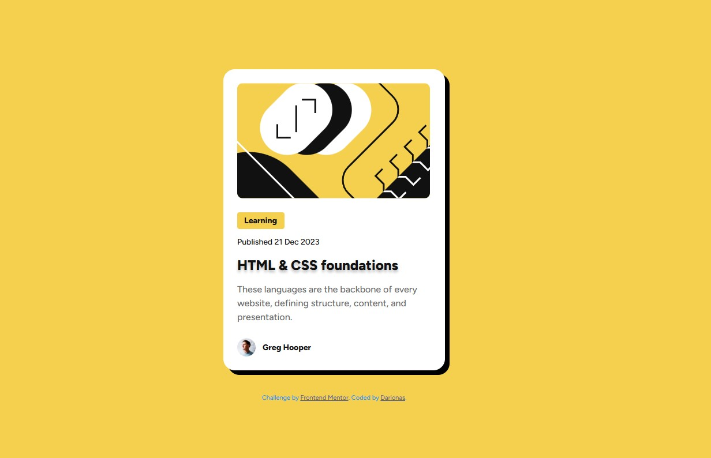

# Frontend Mentor - Blog preview card solution

## Table of contents

- [Overview](#overview)
  - [The challenge](#the-challenge)
  - [Screenshot](#screenshot)
  - [Links](#links)
- [My process](#my-process)
  - [Built with](#built-with)
  - [What I learned](#what-i-learned)
  - [Continued development](#continued-development)
  - [Useful resources](#useful-resources)
- [Author](#author)
- [Acknowledgments](#acknowledgments)

## Overview

### The challenge

Your challenge is to build out this blog preview card and get it looking as close to the design as possible.

Users should be able to:

- See hover and focus states for all interactive elements on the page

### Screenshot

### Links

- Solution URL: [Blog preview card solution](https://github.com/Darionas/blog-preview-card-main)
- Live Site URL: [BLog preview card live site](https://darionas.github.io/blog-preview-card-main/)

## My process

### Built with

- Semantic HTML5 markup
- CSS custom properties (used Figma for styling)
- Flexbox
- CSS Grid
- Mobile-first workflow

### Used techniques:

- BEM
- Accessibility

But created with :heart:

### What I learned

I started using Figma. It let me gain style data for precise styling. I still am lack of practice, but I tend to use it in my new projects. 

### Continued development

- Keep using Figma.
- Keep using TypeScript.

### Useful resources

- [Figma](https://www.frontendmentor.io/articles/figma-for-developers-how-to-work-with-a-design-file-m6CZKZ1rC1) - Basics for Figma. It is good good start for beginners.

## Author

- Frontend Mentor - [@Darionas](https://www.frontendmentor.io/profile/Darionas)
- GitHub - [Darionas](https://github.com/Darionas)

## Acknowledgments

- Thank you Frontend Mentor team for opportunity to try, practice, train yourself in different level challenges and gain invaluable experience.
